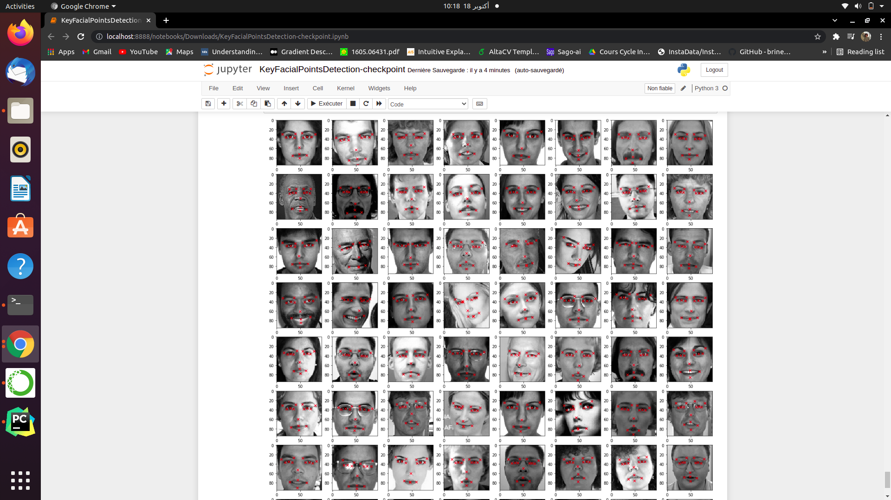

# Key-Facial-Points-Detection

This is a multi-label classification project using ResNet50 architecture.

It's about predicting facial details such as position of eyes,nose, mouth..

# Dataset

You can download dataset from kaggle.com

The dataset consists of x and y coordinates of 15 facial key points.

Input images are 96*96 pixels.

Images consist of only one color channel (gray-scale imagrs)

# Result

